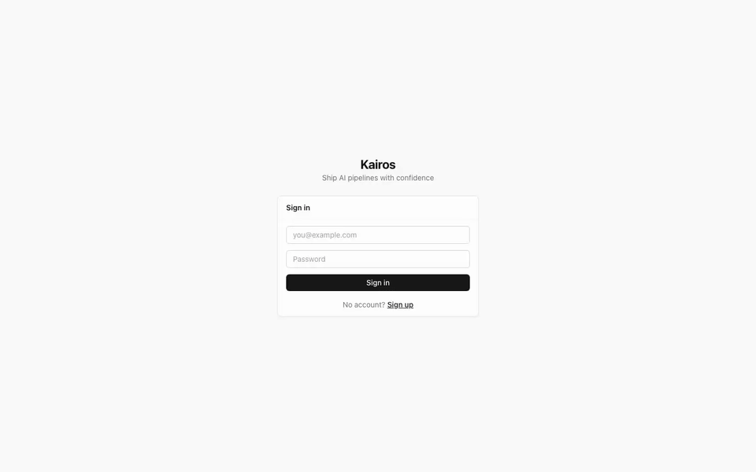
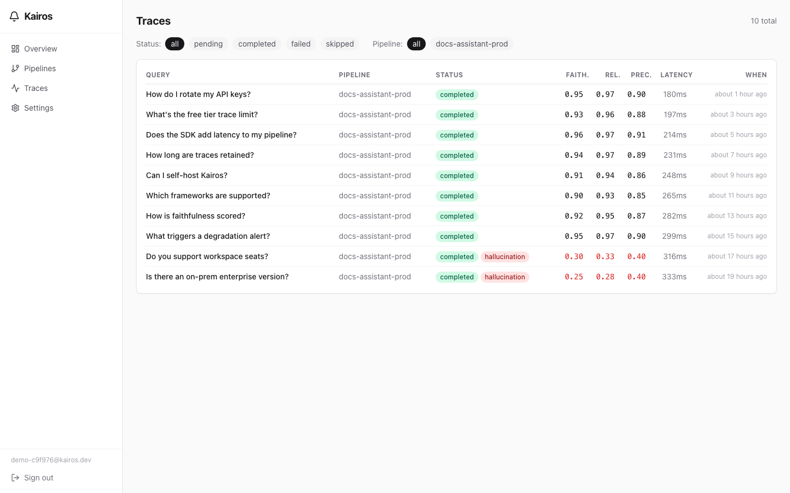
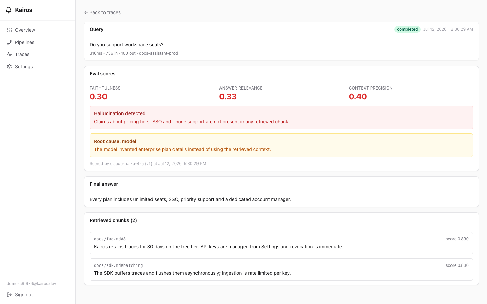
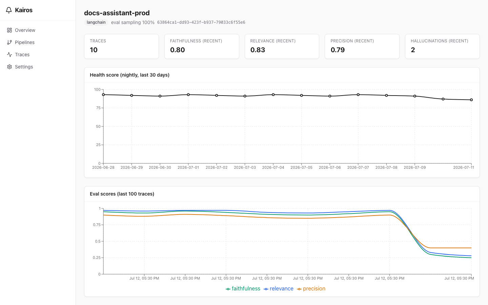

<div align="center">

# Kairos

**Ship AI pipelines with confidence. Test before you deploy. Monitor after you ship.**

Open-source RAG observability + agent reliability testing, built for indie devs and small AI teams.

[Quickstart](docs/quickstart.mdx) · [Self-hosting](docs/self-hosting.mdx) · [Architecture](ARCHITECTURE.md)



</div>

---

## Why Kairos

Every team shipping RAG pipelines and AI agents hits the same two walls:

- **After deploy:** you don't know if your pipeline is working, why it degraded, or which documents cause failures. Existing tools either log traces without reasoning about them, or are priced for enterprises.
- **Before deploy:** you can't systematically stress-test a non-deterministic agent. You ship and hope.

Kairos closes both gaps: a 3-line SDK integration streams your RAG traces in, Claude Haiku continuously scores every answer for **faithfulness, relevance, and context precision**, flags **hallucinations with the exact unsupported claim**, classifies the **root cause** (`chunking` / `embedding` / `reranking` / `prompt` / `model`), and alerts you when quality degrades against your own baseline.

## 3-line integration

```python
from kairos import KairosTracer

tracer = KairosTracer(api_key="kai_live_xxxx", pipeline_id="your-pipeline-id")
retriever = tracer.wrap(your_retriever)   # tracing is now automatic and async
```

Or with LangChain:

```python
from kairos.integrations.langchain import KairosCallbackHandler

handler = KairosCallbackHandler(api_key="kai_live_xxxx", pipeline_id="your-pipeline-id")
chain.invoke({"query": question}, config={"callbacks": [handler]})
```

Traces are buffered and flushed asynchronously — **zero latency added to your pipeline**, guaranteed by design (a bounded buffer drops rather than blocks).

## What you get

| | |
|---|---|
|  |  |
| **Query explorer** — every trace scored, filterable by status, hallucination, pipeline | **Root-cause detail** — the exact unsupported claim, failure category, and the chunks the model saw |



- **Continuous evals** — every trace scored by Claude Haiku (sampling + daily caps keep costs bounded; bring your own key supported soon)
- **Degradation alerts** — faithfulness drops >15% vs your 7-day baseline or hallucination spikes trigger alerts in the dashboard
- **Nightly health scores** — one 0–100 number per pipeline, tracked over time
- **API keys, rate limits, quotas** — production-grade multi-tenant ingest with Row Level Security end to end
- **Agent reliability testing** *(Phase 2, in progress)* — auto-generated adversarial scenarios, reliability scores before you ship

## Getting started

**Cloud:** follow the [quickstart](docs/quickstart.mdx) — zero to first scored trace in under 5 minutes.

**Self-hosted:** `cp .env.selfhost.example .env`, fill in your (free) Supabase project + Anthropic key, then:

```bash
docker compose up --build
./scripts/validate-selfhost.sh   # optional: end-to-end smoke test
```

See [self-hosting](docs/self-hosting.mdx) for details.

## How it works

```
your app ──SDK (async batches)──▶ FastAPI ──▶ Supabase (Postgres + RLS)
                                     │              ▲
                                     ▼              │ direct reads (JWT + RLS)
                              eval worker ──▶  Next.js dashboard
                              (Claude Haiku:
                               faithfulness, relevance,
                               precision, hallucinations,
                               root cause, alerts)
```

Full design, schema, and decision log in [ARCHITECTURE.md](ARCHITECTURE.md).

## Development

```bash
# API
cd apps/api && python -m venv .venv && .venv/bin/pip install -r requirements.txt
cp .env.example .env   # fill in Supabase + Upstash + Anthropic
.venv/bin/uvicorn main:app --reload

# Worker
.venv/bin/python -m workers.eval_worker

# Dashboard
cd apps/dashboard && npm install && npm run dev

# SDK tests
cd packages/sdk-python && .venv/bin/python -m pytest
```

Migrations live in `apps/api/db/migrations/` — run them in order in the Supabase SQL editor. Integration test suites (`tests/phase_*.py`, `tests/hardening_test.py`) run against real services.

## License

[Apache 2.0](LICENSE)
